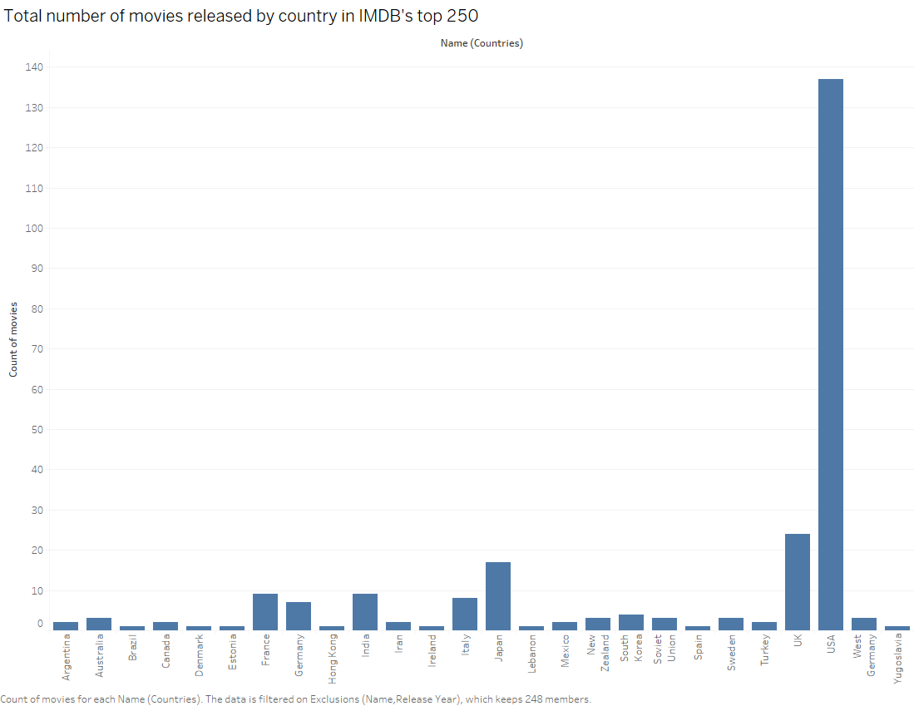
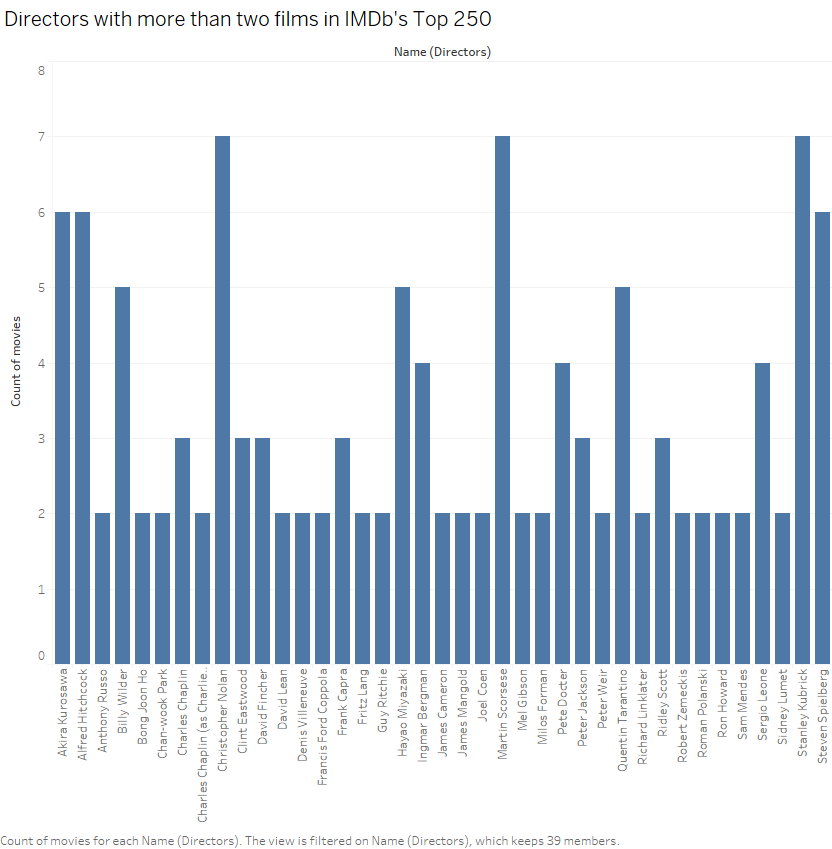
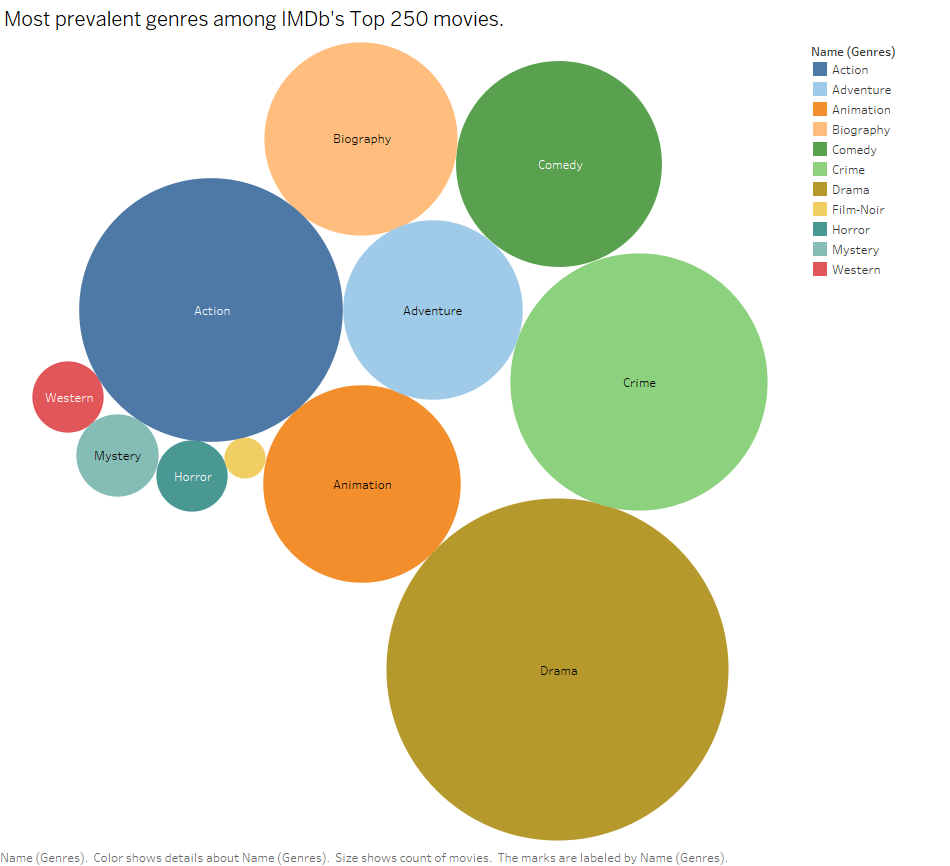
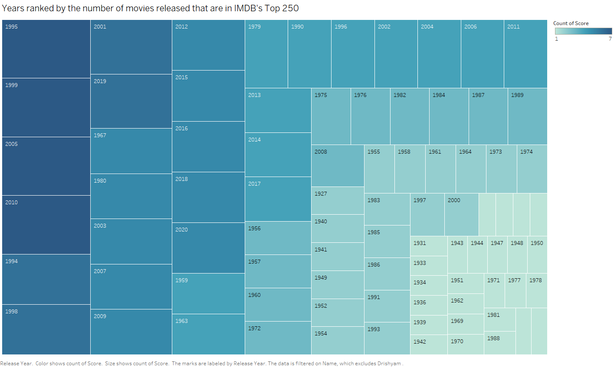

# Web Scraper for IMDB Top 250 Movies

This project is a web scraper that collects detailed information on the top 250 movies from IMDb and organizes the data into a MySQL database. The gathered data includes each movie’s name, IMDb score, release year, age rating, production country, director, and budget. Finally, the data is visualized in Tableau, providing insights into the IMDb Top 250.
Project Overview

## The project is divided into the following stages:

-Data Scraping: Using Selenium and BeautifulSoup, the scraper navigates IMDb’s Top 250 movies page and extracts relevant details for each movie.
-Data Storage: The extracted data is saved as a .txt file and later transferred to a MySQL database through a Python script using mysql.connector.
-Data Visualization: The MySQL database is connected to Tableau to create visualizations of the data.

## Tools & Libraries

-Selenium: For automating web browsing and scraping.
-BeautifulSoup: For parsing HTML content and extracting information.
-MySQL Connector: For connecting Python to MySQL and inserting scraped data into the database.
-Tableau: For visualizing and analyzing data.

